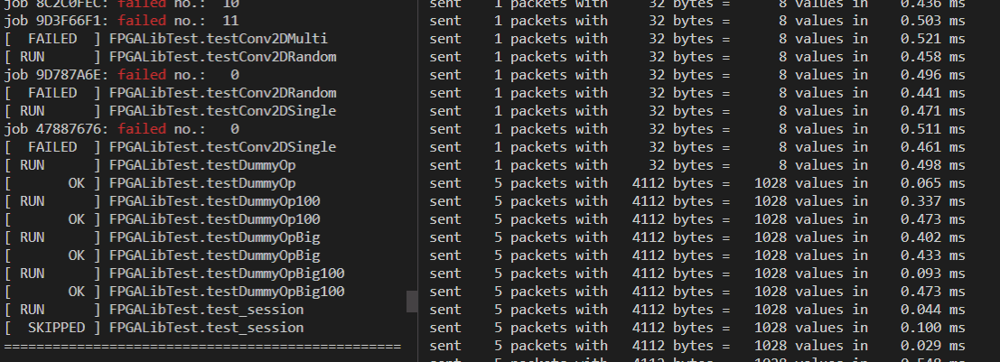
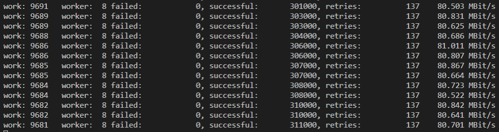
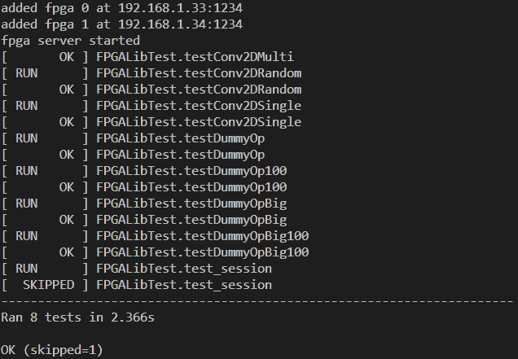

# TensorFlow library for adding FPGA based layers

## Components

- `hostLib/`      Python wrapper module
  - `layers/`     Layer definitions
- `c++/`          TensorFlow custom operator library
  - `lib/mlfpga/` FPGA data transfer library
- [/bachelor/vhdl-modules](https://gitlab.justprojects.de/bachelor/vhdl-modules) VHDL implementation

## Usage

```python
import tensorflow as tf
from tensorflow.keras import models
from hostLib.layers.conv2d import Conv2D as Conv2DFPGA

model = models.Sequential()
model.add(Conv2DFPGA(1))
```

## Installation

1. clone repository and init submodules
    ```bash
    git clone <this url>
    cd ./tf-fpga
    git submodule init
    ```

2. install dependencies (on Ubuntu Linux for example)
    ```bash
    sudo apt update                           
    sudo apt upgrade -y
    sudo apt autoremove
    sudo apt install python3 python3-pip
    sudo python3 -m pip install --upgrade pip # update pip globally
    python3 -m pip install tensorflow
    ```

3. install C++ compiler
    ```bash
    sudo apt install g++
    ```

4. compile operator and fpga libraries
    ```bash
    cd ./c++
    ./configure
    make

    > /usr/bin/g++ ... -o build/dummyBigOp.o src/dummyBigOp.cpp
    > ...
    > /usr/bin/g++ ... -o build/op_lib.so ...
    ```
5. update `config.json` with your FPGA addresses defined in the [VHDL design](https://gitlab.justprojects.de/bachelor/vhdl-modules)
    ```json
    {"fpgas": [
      {
        "ip":   "192.168.1.33",
        "port": 1234
      },
      {
        "ip":   "192.168.1.34",
        "port": 1234
      },
      {
        "ip":   "192.168.1.35",
        "port": 1234
      }
    ]}
    ```

## Adding new custom layers
For more details on how to contribute to git projects see https://gist.github.com/MarcDiethelm/7303312.

0. create a computation module in the [FPGA implementation](https://gitlab.justprojects.de/bachelor/vhdl-modules)
1. add your FPGA module to the list of modules `c++/lib/mlfpga/include/modules.hpp`

    then the `MOD_DEF` macro creates these entries automagically:
    ```c++
    moduleIds[Module::myNewModule];
    moduleNames[Module::myNewModule];
    moduleSendPayloadLength[Module::myNewModule];
    moduleRecvPayloadLength[Module::myNewModule];
    ``` 
2. create a TF kernel implementation `MyNewOp` inherited from `AsyncOpKernel`, inside these files: 

    `c++/src/myNewOp.cpp` and  `c++/include/myNewOp.hpp`

    define the constructor and overwrite the `ComputeAsync` method:
    ```c++
    class MyNewOp : public AsyncOpKernel {
      public:
        explicit MyNewOp(OpKernelConstruction* context);

        void ComputeAsync(OpKernelContext* context, DoneCallback done) override;
    }
    ```
    using your FPGA module
    ```c++
    auto worker = connectionManager.createWorker(Module::myNewModule, count);
    ```
3. register the the kernel with a custom operator:

    `c++/src/entrypoint.cpp`
    ```c++
    REGISTER_OP("MyNewOp")
      .Input("input: float")
      .Output("output: float")
      .SetShapeFn([](InferenceContext* c) {
        c->set_output(0, c->input(0));
        return Status::OK();
      });
    ;

    REGISTER_KERNEL_BUILDER(Name("MyNewOp").Device(DEVICE_CPU), MyNewOp);
    //                                  the custom kernel class /\ 
    ```
    `c++/include/entrypoint.hpp`
    ```c++
    #include "myNewOp.hpp"
    ```

    More information on creating custom TF kernels can be found [here](https://www.tensorflow.org/guide/create_op).

    ---
4. compile everything
    ```bash
    cd ./c++
    make clean
    make
    ```
5. append a test for your operator

    `tests/op_test.py`
    ```python
    def testMyNewOp(self):
      with self.session():
        input = [1,2,3]
        result = load_op.op_lib.MyNewOp(input=input)
        self.assertAllEqual(result, input)
    ```

6. add a custom layer that uses the operator

    `hostLib/layers/myNewLayer.py`
    ```python
    class MyNewLayer(layers.Layer):
      ...
      def call(self, inputs):
        return load_op.op_lib.MyNewOp(input=inputs)

    ```
7. add that layer to the python module

    `hostLib/layers/__init__.py`
    ```python
    __all__ = ["conv2d", "myNewLayer"]
    ```

## Tests
There are tests for each complexity level of this project.

1. loopback test without connected FPGAs. This will only succeed for modules that have equal input and output lengths.

    compile the UDP echo server and run it in a seperate terminal:
    ```bash
    cd ./c++
    make echo
    ./build/echo
    ```
    edit `config.json`:
    ```json
    {"fpgas": [
      {
        "ip":   "localhost",
        "port": 1234
      }
    ]}
    ```
    then run any dummy module test:
    ```bash
    python3 tests/op_test.py
    ```
    

2. FPGA communication test `c++/tests/main.cpp`
    ```bash
    cd ./c++
    make test
    ./build/test
    ```
    

3. operator validation test, based on TFs test suite `tests/op_test.py`
    ```bash
    python3 tests/op_test.py
    ```
    

## Dependencies

### C++
- libstd
- libtensorflow_framework
- https://github.com/nlohmann/json
- `./config.json`

### Python3
- tensorflow
- `c++/build/op_lib.so`

Used in examples:
- Pillow
- CV2
- mss
- numpy
- IPython